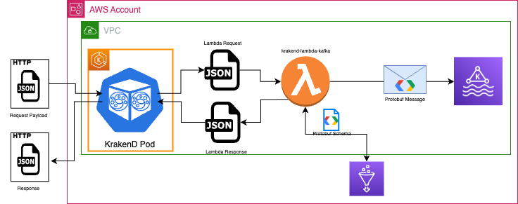

# Lambda Integration With KrakenD

KrakenD offers a native way to connect to different pub/subs providers such as RabbitMQ, AWS SNS/SQS and [Kafka](https://www.krakend.io/docs/backends/pubsub/#kafka)
however, the actual native implementation does not support authentication and only works with plaintext endpoints in addition to that,
KrakenD does not offer any way to publish messages with headers and key as can be imagined, those limitations made impossible to use the native Kafka integration.

KrakenD also offers a native way [to integrate with AWS Lambdas ](https://www.krakend.io/docs/backends/lambda/), in this case the sole limitation is that KrakenD will not
forward the headers, even if there are configured in the `krakend.json` file. In the [documentation ](https://www.krakend.io/docs/backends/lambda/#header-forwarding) they offer a way
to overcome that restriction which is, create a custom payload where you pass all the required parameters.

For an actual usecase, exposing an endpoint that receives a payload not very conventional is not an option thankfully, KrakenD offers another
feature that could be used in order to avoid defining not conventional endpoints, this feature is the transformation of incoming request payloads and
responses using [Lua Scripts](https://www.krakend.io/docs/endpoints/lua/?gclid=Cj0KCQjwoK2mBhDzARIsADGbjeq9zTZd9V0_pKx78lzsCu3UodJiI9ryk9CO_V7Mdgrbf5ejvExV7TgaAjxbEALw_wcB).

The idea is to combine the lambda invocation with the request/response transformations in order to be able to expose a simple POST endpoint and in the following sections
will be explained how to do it

## Table of Contents
1. [Interaction](#interaction)
2. [KrakenD Configuration](#krakend-configuration)
   1. [AWS IAM User](#aws-iam-user)
   2. [Lua Transformation](#lua-transformation)
   3. [krakend.json File Configuration](#krakendjson-file-configuration)
   4. [Endpoint Convention](#endpoint-convention)
   5. [Open API definition](#open-api-definition)

## Interaction
The following image shows how KrakenD, the Lambda, the MSK cluster and the GLue registry interact:



As can be seen, the Lambda, the KrakenD, the MSK  should all be on the same VPC and the AWS Glue registry should be on the same AWS Account as the VPC.

The following are the steps that are going to be executed in order to be able to publish a message in the given MSK Cluster:

1. The KrakenD pod, running in EKS will receive the initial request
2. Using Lua Scripting will extract the headers, the body and other information in order to produce a request that can be accepted by the lambda. 
3. KrakenD will invoke the lambda, passing the transformed payload.
4. The Lambda will receive the payload.
5. The Lambda will obtain the protobuf schema from AWS GLue.
6. The Lambda, using the schema, will generate a protobuf version of the original payload.
7. The Lambda will publish the message adding if present, the headers and/or the key.
8. The Lambda will return a response.
9. The KrakenD pod will transform the response into an HTTP response, extracting the HTTP code from the response and return it to the original caller.

## KrakenD Configuration

The following section will explain what should be done in order to integrate the lambda in KrakenD, also remember to take a look into the 
[documentation](https://www.krakend.io/docs/backends/lambda/#authentication-and-connectivity), in order to be able to understand how to configure the AWS credentials for KrakenD.

### AWS IAM User
KrakenD needs an IAM user capable of executing lambdas also, that user should have an access key. The policy that should be attached to that user should be like this one:

```
{
    "Version": "2012-10-17",
    "Statement": [
        {
            "Effect": "Allow",
            "Action": [
                "lambda:InvokeFunction"
            ],
            "Resource": "arn:aws:lambda:eu-central-1:${account-id}:${function-name}"
        }
    ]
}
```
### Lua Transformation

The file [lambda_req_resp_transformation.lua](lambda_req_resp_transformation.lua) contains all the required to transform the original request into
a new request that could be used by the Lambda. That file should be added in the same folder were the `krakend.json` file is.

### krakend.json File Configuration
One single lambda can handle multiple topics, however it is required to configure each topic as a KrakenD endpoint, the following can be used as a blueprint
for configuring each topic:

```  
       
        {
            "endpoint": "/v1/MyTopic",
            "method": "POST",
            "input_headers": [ "message-headers" , "message-key" ],
            "timeout": "50s",
            "output_encoding": "json",
            "backend": [
                {
                    "host": [ "ignore" ],
                    "url_pattern": "/ignore",
                    "encoding": "json",
                    "extra_config": {
                         "backend/lambda": {
                             "function_name": "actual-function-name",
                              "region": "eu-central-1",
                              "max_retries": 1
                        }
                    }
                }
            ],
            "extra_config": {
                 "modifier/lua-proxy": {
                        "sources": ["lambda_req_resp_transformation.lua"],
                                "pre": "lambda_request_transformation( request.load() );",
                                "post": "lambda_response_transformation( response.load() );",
                                "live": false,
                                "allow_open_libs": true
                }
            }
        }
```
Just replace *MyTopic* for the actual name of the topic and *actual-function-name* for the actual name given to the lambda and that's it,
nothing else is required to be changed.

Remember that this code should be inside the `endpoint` section of the `krakend.json` file, and it should be one per topic.

### Endpoint Convention

In order to be able to extract the headers, key and topic name from the request it is required to follow the next conventions:

* The path of the endpoint should end with **the actual name of the topic**, respecting upper and lower case characters.
  * In the previous example, the topic name in Kafka should be MyTopic.
  * It does not matter what is defined before the topic name, but it is required that the path ends with the actual name.
* The endpoint will only accept two headers:
  * `message-headers`: This header will contain the actual headers to attach to the message, at the moment only can handle strings in this format key=value separated by comma, for example:
    *  `message-headers:mykey=myvalue,otherkey=othervalue`
  * `message-key`: This header is used to define the key to give to the message, it can only accept one value, for example:
    * `message-key:mykey`

There is no restriction on the payload, you can send any JSON version of your message but be aware that the Lambda will validate the payload
against the schema.

#### Open API definition
Here is an example of an openapi definition that can be used for defining events endpoints:
[openapi-example.yaml](openapi-example.yaml)
